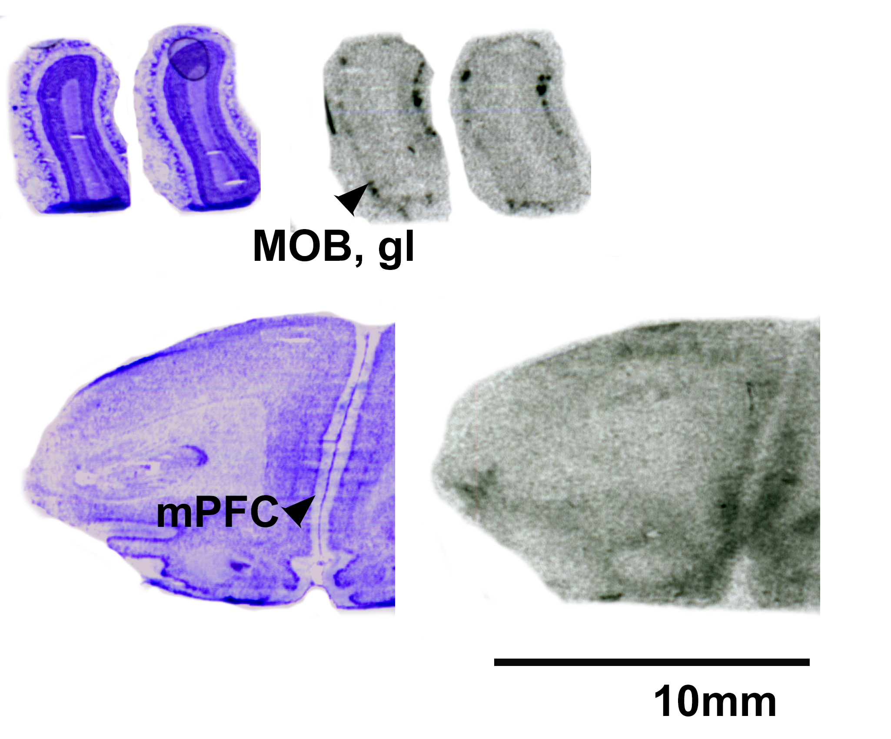

```{r, echo = FALSE}
# For this document to work well, I recommend that you have the packages citr, rticles installed and loaded.

# For more information on Rmarkdown, check out https://rstudio.com/wp-content/uploads/2015/02/rmarkdown-cheatsheet.pdf

# The paths to the datafiles used for the manuscript need to be changed to where you have these files on your computer.

#The bibliography file should be in your project directory (where this Rmarkdown file is) for references to render properly.

#To 'track changes' see the syntax used here: http://criticmarkup.com/users-guide.php
# However, comments {>> This appears as a comment in rendering to word docs<<}
# are always welcome.

OTRdata <-read.csv("C:/Users/HP/Documents/Work/Pouched_rat/autorad pouchie/Pouchie Autorad OTR FINAL.csv")
V1data <- read.csv("C:/Users/HP/Documents/Work/Pouched_rat/autorad pouchie/Pouchie Autorad V1ar FINAL.csv")
OTRPCAdata <-read.csv("C:/Users/HP/Documents/Work/Pouched_rat/autorad pouchie/Pouchie Autorad OTR PCA.csv")
V1PCAdata <-read.csv(file="C:/Users/HP/Documents/Work/Pouched_rat/autorad pouchie/Pouchie Autorad V1ar PCA.csv")

```


# Introduction 

The neuropeptides oxytocin (OT) and vasopressin (AVP) modulate a variety of social behaviors including parental care, affiliation, and aggression, among others [@caldwellOxytocinVasopressinMotivational2015]. These peptides act centrally through their associated receptors, the oxytocin (OTR) and vasopressin 1a and 1b (V1aR and V1bR) receptors. The nonapeptide system is well-conserved, evidenced by the presence of vasopressin, oxytocin, or their homologues in mammals, birds, fish, snails, annelid worms and some insects [@donaldsonOxytocinVasopressinNeurogenetics2008]. Despite the conservation of the OT-AVP system, differences in the relative density and distribution of the OTR and V1aR exist between closely related species [e.g. @beeryOxytocinVasopressinReceptor2008; @campbellCentralVasopressinOxytocin2009; @inselPatternsBrainVasopressin1994; @kalamantiosTelencephalicBindingSites2010]. These differences are thought to support species-specific ecology and mating tactic [@olazabalVariationDensityOxytocin2020], and variation within a single species further supports this hypothesis [@ophirOxytocinReceptorDensity2012; @ophirVariationNeuralV1aR2008; @zhengFemaleAlternativeMating2013; @barrettVariationVasopressinReceptor2013].

In addition to between- and within-species variation in the distribution and relative density of these receptors, several species exhibit sex differences in receptor density [@dumaisVasopressinOxytocinReceptor2016; @inselComparativeDistributionForebrain1991; @campbellCentralVasopressinOxytocin2009; @beeryOxytocinVasopressinReceptor2008; @smeltzerDopamineOxytocinVasopressin2006; @dubois-dauphinExpressionVasopressinReceptors1991; @smithAgeSexDifferences2017; @dumaisSexDifferencesOxytocin2013]. These differences between the sexes are region-specific, and thought to support sex-specific behaviors [@dumaisVasopressinOxytocinReceptor2016]. However, other species lack  sex-differences in receptor distribution in OTR or V1aR in the brain [@inselPatternsBrainVasopressin1994; @freemanCentralDistributionOxytocin2019; @limVentralStriatopallidalOxytocin2004]. Whether sex differences are observed depends on whether both sexes were studied, and whether areas that are sexually dimorphic with respect to receptor binding were measured. Nonetheless, exploring sex differences in receptor distribution can reveal insight into possible differences in nonapeptide system sensitivities between the sexes, and provides the essential foundation for further functional empirical studies.

In order to understand the evolutionary trajectory of the nonapeptide system, several research teams have explored how the receptor structure and densities differ among species  [@barberisVasopressinOxytocinReceptors1996; @donaldsonOxytocinVasopressinNeurogenetics2008; @freemanComparisonDistributionOxytocin2020; @olazabalVariationDensityOxytocin2020]. This investigation into the deep homologies of oxytocin and vasopressin suggest that OTR and V1aR have had different selective pressures leading to variation among species [@freemanComparisonDistributionOxytocin2020], with variation allowing potentially for specializations in behavior within species or genera. Comparative analyses such as these are essential for understanding how these systems have evolved, and to reach a 'unified theory of behavior' [@kellyComparedWhatWhat2015]. As an example, early studies in Microtus voles examining the distribution and density of receptors suggested monogamy was driven by differences in a few specific brain regions [@inselOxytocinReceptorDistribution1992]. Yet, further work in Peromyscus mice showed that variation in receptor density and expression differed between monogamous mice and voles [@turnerMonogamyEvolvesMultiple2010; @inselComparativeDistributionForebrain1991]. Therefore, to understand how the OT-VP system modulates behavior, many taxa will need to be studied to understand how the conservation of receptor distribution impacts behavior. Despite these differences in receptor distribution between monogamous voles and Peromyscus mice, the role of OT and AVP in broadly modulating affiliation and cooperation across rodents and mammals has been repeatedly supported [@caldwellOxytocinVasopressinMotivational2015].

The African giant pouched rat (_Cricetomys ansorgei_) is a large, nocturnal rodent native to sub-Saharan Africa. This species is known for its olfactory behavior and capabilities [@freemanGiantPouchedRat2020; @polingUsingGiantAfrican2010; @weetjensAfricanPouchedRats2009], which are thought to be due to its relatively large olfactory bulbs [@ibeFunctionalMorphologyBrain2014]. The pouched rat's common name is partially based on its convergent rat-like appearance since these species are only distantly related to traditional lab mouse and rat models [@olayemiTaxonomyAfricanGiant2012; @steppanMuroidRodentPhylogenetics2017]. There are very few studies describing the behavior of pouched rats, and fewer describing _C. ansorgei_ specifically. However, the aggressive behavior between unfamiliar animals and territorial scent marking behavior [@freemanScentmarkingBehaviorSouthern2018] suggests that these animals might prefer to live in small family groups. In studies of _C. gambianus_, in groups of up to six animals only one male and female would successful pair and mate, and parental care is largely provided by the female [@ajayiBehaviouralChangesAfrican1978]. In the field, groups of pouched rats have been located, but it unclear how common these are, or if the animals were related or part of a family group [@cooperAfricanGiantPouched2014].

Given the importance of the OT and AVP system in social behavior, and the need for additional comparative work exploring the evolution of these peptides, we sought to describe the distribution of OTR and V1aR in the brain of the southern giant pouched rat (_C. ansorgei_). We hypothesized that differences between the sexes might support sex-specific behaviors in this species similar to sex differences seen in other rodents. We hypothesized that the patterning of these receptors' densities across specific regions might differ from other rodents in ways that mirror the current phylogeny, whereby pouched rats would be similar to both Murinae and Cricetidae.

 
 

# Methods 

All work with animals was approved under the U.S. Army Medical Research and Materiel Command (USAMRMC) Animal Care and Use Review Office (ACURO) and the Cornell Institutional Animal Care and Use Committee (IACUC 2014-0043). Tissues were collected from wild-caught animals from Morogoro, Tanzania (6&deg;49'49"S, 37&deg;40'14"E). Prior to collection, animals were housed individually in standard rabbit enclosures and maintained on a 12:12 h light:dark light cycle, at 21&deg;C and 45% humidity. Males and females were kept in separate rooms. Animals were fed a standard rodent diet supplemented with dog kibble and fresh fruit and vegetable treats. Chewing bones, a metal 'stovepipe' hutch, and dog puzzle toys were given as behavioral enrichment. Newspaper was given for nesting material.

Animals were euthanized via CO~2~ inhalation and brains were swiftly removed and frozen using liquid nitrogen or powdered dry ice and stored at -80&deg;C prior to sectioning. Ten male and ten female brains were used for this study. Brains were blocked coronally by removing the cerebellum, then split sagittally next to the midline into two hemispheres, and one hemisphere (preferably the left if unblemished) was coronally sectioned at 20µm thick using a Leica cryostat (CM1950, Leica Biosystems, Nussloch, Germany) set at -20&deg;C. Due to the large size of the pouched rat brains, we mounted every 3rd section and kept 6 serial sets. Sections were collected from the olfactory bulbs to the start of the cerebellum, and mounted on Superfrost Plus Microscope sides (Fisher Scientific, Pittsburg, PA USA). Microscope slides were stored at -80ºC until the autoradiography procedure.

On two of the sets of slides, we used ^125^I radioligands to label oxytocin receptor (ornithine vasopressin analog, ^125^I-OVTA); NEX 254, PerkinElmer; Waltham, MA) or vasopressin 1a receptor (vasopressin (Linear), V-1A antagonist (Phenylacetyl1, 0-Me-D-Tyr2 [ ^125^I-Arg6 ]-); NEX 310, PerkinElmer), as described by Ophir and colleagues [@ophirStabilityDynamicsForebrain2013]. Following processing and air-drying, we exposed radiolabeled tissue to film (Kodak Carestream Biomax MR) for 6 days for OTR and 2 days for V1aR to account for differing degrees of decay at the time of use. In each film cassette, we included two ^125^I microscales (American Radiolabeled Chemicals; St Louis, MO), to allow for the conversion of optical density to receptor density. We inferred that receptor density relates to optical density of exposed film, and we therefore used optical measurements as a proxy for receptor density. We digitized films on a Microtek ArtixScan M1 (Microtek, Santa Fe Springs, CA) and measured optical densities using NIH ImageJ Software. We calculated receptor density by first converting optical density to disintegrations per minute (dpm) adjusted for tissue equivalence (TE; for 1 mg in the rat brain), by fitting curves generated by radiographic standards and extrapolating based on these standard curves for each film.

Three sequential sections were measured for density by encircling the regions of interest using NIH ImageJ software. The software program calculated mean optical density values and area for regions of interest (ROI). We measured background labelling by measuring optical density from an area of cortex with no visually apparent binding in the same section for each region of interest. To correctly identify ROI, we Nissl-stained a third set of tissue to use as a reference, in conjunction with anatomical landmarks identified using a Rat brain atlas. The three measurements for each individual's ROIs and background were averaged separately, and background was subtracted from the ROI to yield receptor density. These final measurements were used for all statistical tests, tables, and figures.

OTR density was measured in the olfactory bulb (OB), anterior olfactory nucleus (AON), prefrontal cortex (PFC), piriform cortex (Pir), nucleus accumbens (NAcc), lateral septum (LS), endopiriform (Den), claustrum (VCL), lateral bed nucleus of the stria terminalis (BSTl), medial bed nucleus of the stria terminalis (BSTm), ventral bed nucleus of the stria terminalis (BSTv), ventral pallidum (VPall), medial preoptic area (MPOA), anterior hypothalamus (AH), paraventricular thalamus (PVT), suprachiasmatic nucleus (SCN), paraventricular nucleus (PVN), magnocellular hypothalamic nucleus (MCPO), medial habenula (MHb), central amygdala (CeA), medial amygdala (MeA), basolateral amygdala (BLA), ventromedial hypothalamus (VMH), zona incerta (ZIR), lateral hypothalamus (PrFLH), hippocampal CA1, hippocampal CA2, hippocampal CA3, dentate gyrus (DG), premammilary ventral nucleus (PMV), ventral tegmental area (VTA), periaqueductal gray (PAG), medial geniculate (MG), superior colliculus (SuG), and the ventral CA3. V1aR was measured in the same regions except for the MCPO and the MHb.

To calculate 'relative binding' on a 4-point scale, we used the following definitions: mean OTR < 35 dpm/mg: absent/-, 35 to 490: present/+, 490 to 945: moderate/++, 945 to 1400: dense/+++; mean V1aR < 100 dpm/mg: absent/-, 100-1367: present/+, 1367 to 2634: moderate/++, 2634 to 3800: dense/+++. To compare receptor densities between sexes, we conducted t-tests for each region. We used a bonferroni correction to adjust for multiple comparisons. Test statistics were considered significant when p < 0.05. 

We used the framework from Freeman et al. (2020) to compare overall binding patterns in the pouched rat to those in other rodents [@freemanComparisonDistributionOxytocin2020]. This framework uses overall OTR and V1aR binding patterns to examine similarities among species, genera, and family groups. Briefly, relative binding patterns within a species are converted to a 4-point scale, using wording and data from previously published studies. These data are then used in a principal components analysis, and species are plotted along the PC1 and PC2 components, with vectors in the plot serving as weights of each variable, and the direction indicating loading on PC1 and PC2. 

We mapped pouched rat relative binding data onto this plot based on this framework and the data presented in this study. In addition to superimposing the pouched rat onto the PCA biplot, we conducted a comparative permutational MANOVA ('Adonis' function) to examine whether genus or family groups predicted similarities among species' relative binding patterns using the previously published data and the data from this paper. All analyses were conducted in R 4.0.2, with the vegan package for the 'Adonis' function, and stats package for t-tests and principal components analysis [@rdevelopmentcoreteamLanguageEnvironmentStatistical2016]. PCA biplots were made using the ggbiplot function in the ggbiplot package with some aesthetic changes.

# Results 

```{r load packages set functions, echo=FALSE, results="hide", message=FALSE}
# load all necessary libraries ----
load_pkg <- rlang::quos(tidyverse, ade4, ade4TkGUI, exactRankTests, ggplot2, stargazer, ggthemes, lme4, lmerTest, emmeans, extrafont, car, corrplot, tidyverse, dplyr, ggpubr, osfr, broom, Unicode, vegan)

invisible(lapply(lapply(load_pkg, rlang::quo_name),
  library,
  character.only = TRUE
))
#font_import() #if you haven't loaded and run extrafont package before

#
serr <- function(x) sqrt(var(x,na.rm=TRUE)/length(na.omit(x)))

theme_alex <- function(base_size=24, base_family ="Arial") {
  theme_few() %+replace%
    theme(axis.ticks = element_blank(), legend.title=element_text(size=24, face="bold"), 
          axis.title=element_text(size=24,face="bold"),
          axis.line = element_line(colour = "black"),
          panel.border = element_blank(),
          legend.position = "right")
  
}

summary(OTRdata)
summary(V1data)

summary(lm(OB..final. ~ Sex, data=OTRdata))

# Run t-tests ----
t.test(OB..final. ~Sex, data=OTRdata)
t.test(AON..final. ~Sex, data=OTRdata)
t.test(mPFC..final. ~Sex, data=OTRdata)
t.test(mPFC..final..1 ~Sex, data=OTRdata)
t.test(Nacc..final. ~Sex, data=OTRdata)
t.test(Nacc..final..1 ~Sex, data=OTRdata)
t.test(Caudate.P..Final. ~Sex, data=OTRdata)
t.test(PirCtx..final. ~Sex, data=OTRdata)
t.test(LS.I..final. ~Sex, data=OTRdata)
t.test(LS.D..final. ~Sex, data=OTRdata)
t.test(LSV..final. ~Sex, data=OTRdata)
t.test(Endopir..final. ~Sex, data=OTRdata)
t.test(Claustrum..final. ~Sex, data=OTRdata)
t.test(BSTm..final. ~Sex, data=OTRdata)
t.test(BSTi..final. ~Sex, data=OTRdata)
t.test(BSTv..final. ~Sex, data=OTRdata)
t.test(Vpall..final. ~Sex, data=OTRdata)
t.test(MPOA..final. ~Sex, data=OTRdata)
t.test(AH..final. ~Sex, data=OTRdata)
t.test(PVT..final. ~Sex, data=OTRdata)
t.test(SCN..final. ~Sex, data=OTRdata)
t.test(PVN..final. ~Sex, data=OTRdata)
t.test(MHypNuc..final. ~Sex, data=OTRdata)
t.test(Med.Habenula..final. ~Sex, data=OTRdata)
t.test(CeA..final. ~Sex, data=OTRdata)
t.test(MeA..final. ~Sex, data=OTRdata)
t.test(BLA..final. ~Sex, data=OTRdata)
t.test(VMH..final. ~Sex, data=OTRdata)
t.test(Zona.Incert..final. ~Sex, data=OTRdata)
t.test(Lat.Hyp..final. ~Sex, data=OTRdata)
t.test(CA1..final. ~Sex, data=OTRdata)
t.test(CA2..final. ~Sex, data=OTRdata)
t.test(CA3..final. ~Sex, data=OTRdata)
t.test(DG..final. ~Sex, data=OTRdata)
t.test(Premamm..final. ~Sex, data=OTRdata)
t.test(VTA..final. ~Sex, data=OTRdata)
t.test(PAG..final. ~Sex, data=OTRdata)
t.test(Mgen..final. ~Sex, data=OTRdata)
scol.OT <- t.test(Scol..final. ~Sex, data=OTRdata)
t.test(Ventral.CA3..final. ~Sex, data=OTRdata)

t.test(OB..final. ~Sex, data=V1data)
t.test(AON..final. ~Sex, data=V1data)
t.test(mPFC..final. ~Sex, data=V1data)
t.test(mPFC..final..1 ~Sex, data=V1data)
t.test(Nacc..final. ~Sex, data=V1data)
t.test(Nacc..final..1 ~Sex, data=V1data)
t.test(Caudate.P..Final. ~Sex, data=V1data)
t.test(PirCtx..final. ~Sex, data=V1data)
t.test(LS.I..final. ~Sex, data=V1data)
t.test(LS.D..final. ~Sex, data=V1data)
t.test(LSV..final. ~Sex, data=V1data)
t.test(Endopir..final. ~Sex, data=V1data)
t.test(Claustrum..final. ~Sex, data=V1data)
t.test(BSTm..final. ~Sex, data=V1data)
t.test(BSTi..final. ~Sex, data=V1data)
t.test(BSTv..final. ~Sex, data=V1data)
t.test(Vpall..final. ~Sex, data=V1data)
t.test(MPOA..final. ~Sex, data=V1data)
t.test(AH..final. ~Sex, data=V1data)
t.test(PVT..final. ~Sex, data=V1data)
t.test(SCN..final. ~Sex, data=V1data)
t.test(PVN..final. ~Sex, data=V1data)
#t.test(MHypNuc..final. ~Sex, data=V1data)
#t.test(Med.Habenula..final. ~Sex, data=V1data)
t.test(CeA..final. ~Sex, data=V1data)
t.test(MeA..final. ~Sex, data=V1data)
t.test(BLA..final. ~Sex, data=V1data)
t.test(VMH..final. ~Sex, data=V1data)
t.test(Zona.Incert..final. ~Sex, data=V1data)
t.test(Lat.Hyp..final. ~Sex, data=V1data)
t.test(CA1..final. ~Sex, data=V1data)
t.test(CA2..final. ~Sex, data=V1data)
t.test(CA3..final. ~Sex, data=V1data)
t.test(DG..final. ~Sex, data=V1data)
t.test(Premamm..final. ~Sex, data=V1data)
t.test(VTA..final. ~Sex, data=V1data)
t.test(PAG..final. ~Sex, data=V1data)
t.test(Mgen..final. ~Sex, data=V1data)
t.test(Scol..final. ~Sex, data=V1data)
t.test(BSTv..final. ~Sex, data=V1data)
t.test(Ventral.CA3..final. ~Sex, data=V1data)
```

After comparing male and female densities in the measured regions, most regions showed no significant differences between sexes. The superior colliculus had higher densities of OTR in females compared to males (Table 1, Female mean: `r round(scol.OT$estimate[1], digits= 2)`, Male mean `r round(scol.OT$estimate[2], digits = 2)`, t~(`r round(scol.OT$parameter, digits = 2)`)~ = `r round(scol.OT$statistic, digits = 2)`, p = `r round(scol.OT$p.value, digits = 2)`), however, this was no longer significant after corrections for multiple comparisons (adjusted $\alpha$ = 0.001).


```{r pouchie ot data, echo=FALSE, results="hide"}
# graphing ----------------------------------------------------------------

# M <- cor(OTRPCAdata[,3:42], use="pairwise.complete.obs")
# warnings()
# corrplot(M, method="circle")
# OTR.pca <- prcomp(M)
# summary(OTR.pca)
# OTRPCAdata$ID <- as.factor(OTRPCAdata$ID)
# ggbiplot(OTR.pca, groups=OTRPCAdata$Sex, ellipse=T)

OTRPCAdatalong <- gather(OTRPCAdata, condition, measurement,  Olfactory.Bulb:Ventral.CA3, factor_key=T)
#head(OTRPCAdatalong)


# ggplot(OTRPCAdatalong, aes(x = Sex, y = measurement, group=condition, color=Sex, group=Sex)) +
#   geom_violin() +
#   facet_wrap(~ condition, ncol=4)
# 
```

\newpage
```{r OTR table, echo=FALSE, message=FALSE}
sum_OTdata <- OTRPCAdatalong %>% drop_na() %>%
    group_by(condition, Sex) %>%
    dplyr::summarize(density_mean = round(mean(measurement), digits = 2),
              density_serr = round(serr(measurement), digits = 2),
              n_datapoints =n()) %>%
  ungroup()

sum_OTdata$condition <- gsub("[.]", " ", sum_OTdata$condition) 
kable_OTcol2 <- paste(sum_OTdata$density_mean, "±", sum_OTdata$density_serr)

sum_OTdata2 <- sum_OTdata %>% select(-one_of("density_serr"), -one_of("density_mean"))  %>% add_column(kable_OTcol2, .before= "n_datapoints") %>% filter(condition !="Dentate Gyrus" & condition !="Medial Geniculate" & condition !="Ventral CA3")
                        
large_colnames <- c("Region", "Sex", "Density mean ± SE (dpm/mg)", "N")
knitr::kable(sum_OTdata2, col.names = large_colnames, align='llrr', caption="OTR densities by region and sex")
```
\newpage

Pouched rats had very dense OTR binding in the VMH, with moderate binding in the BNST, CeA and VTA. There was only a low level of binding in the OB and mPFC (Table 2, Figure 1). Extremely low levels of OTR binding were observed in NAcc, LS, PVN, and thalamus (Figures 2-4).

```{r OTR relative table, echo=FALSE}
OTRcategory <- data.frame("Region" = c("Olfactory Bulb", "Nucleus Accumbens", "mPFC", "Ventral Pallidum", "Lateral Septum", "BST", "CeA", "MeA", "Hippocampus", "VMH", "VTA"), "Relative Binding" = c("+", "+", "+", "-", "+", "++", "++", "+", "+", "+++", "++"))

knitr::kable(OTRcategory, align='lc', caption="OTR relative densities in select regions")

```




```{r pouchie v1 data long, echo=FALSE, include=FALSE, fig.width= 4, fig.height=7}

V1PCAdatalong <- gather(V1PCAdata, condition, measurement, Olfactory.Bulb:Ventral.CA3, factor_key=T)
#head(V1PCAdatalong)
```

\newpage
```{r V1aR table, echo=FALSE, message=FALSE}
sum_data <- V1PCAdatalong %>% drop_na() %>%
    group_by(condition, Sex) %>%
    dplyr::summarize(density_mean = round(mean(measurement), digits = 2),
              density_serr = round(serr(measurement), digits = 2),
              n_datapoints =n()) %>%
  ungroup()

sum_data$condition <- gsub("[.]", " ", sum_data$condition) 
kable_col2 <- paste(sum_data$density_mean, "±", sum_data$density_serr)

sum_data2 <- sum_data %>% select(-one_of("density_serr"), -one_of("density_mean"))  %>% add_column(kable_col2, .before= "n_datapoints") %>% filter(condition !="CA1" & condition !="CA3")
                        
large_colnames <- c("Region", "Sex", "Density mean ± SE (dpm/mg)", "N")
knitr::kable(sum_data2, col.names = large_colnames, align='llrr', caption="V1aR densities by region and sex")
```
\newpage

After comparing male and female densities of V1aR in the measured regions, we detected no significant differences between sexes (Table 3).

Pouched rats had relatively very dense V1aR binding in the LS (Figure 6), and moderately dense levels of V1aR binding in the Olfactory Bulbs, BST, NAcc, Amygdalar and Hypothalamic Nuclei (Figures 5-10). Binding in the Hippocampus was generally absent except for some moderate V1aR binding in the most ventral regions (Figure 10).

   


\newpage

  


\newpage

  

\newpage


\newpage

  

\newpage

  


```{r v1aR relative table, echo=FALSE}
V1rcategory <- data.frame("Region" = c("Olfactory Bulb", "Nucleus Accumbens", "mPFC", "Ventral Pallidum", "Lateral Septum", "BST", "CeA", "MeA", "PVN", "Hippocampus", "Dentate Gyrus", "Premammillary Nucleus", "VMH", "VTA"), "Relative Binding" = c("++", "++", "+", "+", "+++", "++", "++", "+", "+", "-", "+", "++", "+", "+"))

knitr::kable(V1rcategory, align='lc', caption="V1aR relative densities in select regions")

```


```{r ggbiplot function, echo=FALSE, results="hide"}

# GGbiplot function -------------------------------------------------------
#This function edited to make vector labels parallel and black.
#also new is option to flip x axis, which will nudge the vector labels too

ggbiplot <- function (pcobj, choices = 1:2, scale = 1, pc.biplot = TRUE, 
                      obs.scale = 1 - scale, var.scale = scale, groups = NULL, 
                      ellipse = FALSE, ellipse.prob = 0.68, labels = NULL, shapes = NULL, labels.size = 3, 
                      alpha = 1, var.axes = TRUE, circle = FALSE, circle.prob = 0.69, 
                      varname.size = 3, varname.adjust = 1.5, varname.abbrev = FALSE, flip.x = FALSE, flip.y =                        FALSE,
                      ...) 
{
  library(ggplot2)
  library(plyr)
  library(scales)
  library(grid)
  library(extrafont)
  stopifnot(length(choices) == 2)
  if (inherits(pcobj, "prcomp")) {
    nobs.factor <- sqrt(nrow(pcobj$x) - 1)
    d <- pcobj$sdev
    u <- sweep(pcobj$x, 2, 1/(d * nobs.factor), FUN = "*")
    v <- pcobj$rotation
  }
  else if (inherits(pcobj, "princomp")) {
    nobs.factor <- sqrt(pcobj$n.obs)
    d <- pcobj$sdev
    u <- sweep(pcobj$scores, 2, 1/(d * nobs.factor), FUN = "*")
    v <- pcobj$loadings
  }
  else if (inherits(pcobj, "PCA")) {
    nobs.factor <- sqrt(nrow(pcobj$call$X))
    d <- unlist(sqrt(pcobj$eig)[1])
    u <- sweep(pcobj$ind$coord, 2, 1/(d * nobs.factor), FUN = "*")
    v <- sweep(pcobj$var$coord, 2, sqrt(pcobj$eig[1:ncol(pcobj$var$coord), 
                                                  1]), FUN = "/")
  }
  else if (inherits(pcobj, "lda")) {
    nobs.factor <- sqrt(pcobj$N)
    d <- pcobj$svd
    u <- predict(pcobj)$x/nobs.factor
    v <- pcobj$scaling
    d.total <- sum(d^2)
  }
  else {
    stop("Expected a object of class prcomp, princomp, PCA, or lda")
  }
  choices <- pmin(choices, ncol(u))
  df.u <- as.data.frame(sweep(u[, choices], 2, d[choices]^obs.scale, 
                              FUN = "*"))
  v <- sweep(v, 2, d^var.scale, FUN = "*")
  df.v <- as.data.frame(v[, choices])
  names(df.u) <- c("xvar", "yvar")
  names(df.v) <- names(df.u)
  if (pc.biplot) {
    df.u <- df.u * nobs.factor
  }
  r <- sqrt(qchisq(circle.prob, df = 2)) * prod(colMeans(df.u^2))^(1/4)
  v.scale <- rowSums(v^2)
  df.v <- r * df.v/sqrt(max(v.scale))
  if (obs.scale == 0) {
    u.axis.labs <- paste("standardized PC", choices, sep = "")
  }
  else {
    u.axis.labs <- paste("PC", choices, sep = "")
  }
  u.axis.labs <- paste(u.axis.labs, sprintf("(%0.1f%% explained var.)", 
                                            100 * pcobj$sdev[choices]^2/sum(pcobj$sdev^2)))
  if (!is.null(labels)) {
    df.u$labels <- labels
  }
  if (!is.null(groups)) {
    df.u$groups <- groups
  }
  if (!is.null(shapes)) {
    df.u$shapes <- shapes
  }
  if (varname.abbrev) {
    df.v$varname <- abbreviate(rownames(v))
  }
  else {
    df.v$varname <- rownames(v)
  }
  df.v$angle <- with(df.v, (180/pi) * atan(yvar/xvar))
  df.v$hjust = with(df.v, (1 - varname.adjust * sign(xvar))/2)
  g <- ggplot(data = df.u, aes(x = xvar, y = yvar, family="Arial")) + xlab(u.axis.labs[1]) + 
    ylab(u.axis.labs[2]) + coord_equal()
  if (var.axes) {
    if (circle) {
      theta <- c(seq(-pi, pi, length = 50), seq(pi, -pi, 
                                                length = 50))
      circle <- data.frame(xvar = r * cos(theta), yvar = r * 
                             sin(theta))
      g <- g + geom_path(data = circle, color = muted("white"), 
                         size = 1/2, alpha = 1/3)
    }
    g <- g + geom_segment(data = df.v, aes(x = 0, y = 0, 
                                           xend = xvar, yend = yvar), arrow = arrow(length = unit(1/2, 
                                                                                                  "picas")), color = "black")
  }
  if (!is.null(df.u$labels)) {
    if (!is.null(df.u$groups)) {
      g <- g + geom_text(aes(label = labels, color = groups), 
                         size = labels.size, family="Arial", position=position_jitter(width=0.15, height=0.15)) #here
    }
    else {
      g <- g + geom_text(aes(label = labels), size = labels.size, family="Arial", position=position_jitter(width=0.15, height=0.15))
    }
  }
  else {
    if (!is.null(df.u$groups)) {
      if (!is.null(df.u$shapes)) {
        df.u$shapes <- as.factor(df.u$shapes)
        levels(df.u$shapes) <- rep(21:25, (length(df.u$shapes)))
        g <- g +  geom_point(aes(color = "black", shape = as.integer(as.character(df.u$shapes)), fill=groups, size=3), alpha = alpha) +
          scale_shape_identity() #aes(color = groups, shape = as.integer(as.character(df.u$shapes)), fill = groups, size=3)
      }
      else {
        g <- g +  geom_point(aes(color = groups), alpha = alpha)
      }
    }
    else {
      g <- g + geom_point(alpha = alpha)
    }
  }
  if (!is.null(df.u$groups) && ellipse) {
    theta <- c(seq(-pi, pi, length = 50), seq(pi, -pi, length = 50))
    circle <- cbind(cos(theta), sin(theta))
    ell <- ddply(df.u, "groups", function(x) {
      if (nrow(x) <= 2) {
        return(NULL)
      }
      sigma <- var(cbind(x$xvar, x$yvar))
      mu <- c(mean(x$xvar), mean(x$yvar))
      ed <- sqrt(qchisq(ellipse.prob, df = 2))
      data.frame(sweep(circle %*% chol(sigma) * ed, 2, 
                       mu, FUN = "+"), groups = x$groups[1])
    })
    names(ell)[1:2] <- c("xvar", "yvar")
    g <- g + geom_path(data = ell, aes(color = groups, group = groups))
  }

  if (var.axes) {
      if (flip.x==T & flip.y !=T) {
        g <- g + geom_text(data = df.v, aes(label = varname, 
                                        x = xvar, y = yvar, hjust = hjust, family="Arial"), 
                       color = "black", size = varname.size ,nudge_x=-.1, nudge_y=.1)
      } #let's see? had the else here.
      else if (flip.y==T & flip.x !=T) {
        g <- g + geom_text(data = df.v, aes(label = varname, 
                                        x = xvar, y = yvar, hjust = hjust, family="Arial"), 
                       color = "black", size = varname.size,nudge_x=.1, nudge_y=-.1)
      }
      else if (flip.y==T & flip.x ==T) {
        g <- g + geom_text(data = df.v, aes(label = varname, 
                                        x = xvar, y = yvar, hjust = hjust, family="Arial"), 
                       color = "black", size = varname.size,nudge_x=-.1, nudge_y=-.1)
      }
     else
    g <- g + geom_text(data = df.v, aes(label = varname, 
                                        x = xvar, y = yvar, hjust = hjust, family="Arial"), 
                       color = "black", size = varname.size)
    #    g <- g + geom_text(data = df.v, aes(label = varname, 
            #  x = xvar, y = yvar, angle = angle, hjust = hjust, family="Arial"), 
             # color = "black", size = varname.size)
          }
  if (flip.x==T) {
    g <- g + scale_x_reverse()
  }  
  if (flip.y==T) {
    g <- g + scale_y_reverse()
  }  
  return(g)
}

```

```{r OSF pull, echo=FALSE, include=FALSE}
osf_retrieve_node("https://osf.io/bg6mq")%>%
  osf_ls_files() %>%
  osf_download(conflicts = "overwrite")


v1MS <- read.csv(file="v1MS.csv")
summary(v1MS) 

## Create variables for V1a Comparison
Species <- v1MS$X
fullname <- v1MS$fullname
Familyg <- v1MS$family
mygenus <- v1MS$genus

## Subset data points with relative binding, 
## such that there are more species than regions 
## (in order to not violate PCA assumptions)
v1MSregions <- v1MS[,5:10]

V1new <- c(x = 'Pouched rat', family = 'Nesomyidae', genus = 'Cricetomys', fullname = 'Cricetomys ansorgei', "VPal" = as.numeric(1), "LS" = 3, "BNST" = 2, "CeA" = 2, "MeA" = 1, "DG" = 1)
pouchie_adonisdata <- rbind(v1MS, V1new)
pouchie_adonisdata$VPal <- as.numeric(as.character(pouchie_adonisdata$VPal))
pouchie_adonisdata$LS <- as.numeric(as.character(pouchie_adonisdata$LS))
pouchie_adonisdata$BNST <- as.numeric(as.character(pouchie_adonisdata$BNST))
pouchie_adonisdata$CeA <- as.numeric(as.character(pouchie_adonisdata$CeA))
pouchie_adonisdata$MeA <- as.numeric(as.character(pouchie_adonisdata$MeA))
pouchie_adonisdata$DG <- as.numeric(as.character(pouchie_adonisdata$DG))

pouchie_MSregions <- pouchie_adonisdata[, 5:10]

Familypg <- pouchie_adonisdata$family
mypgenus <- pouchie_adonisdata$genus

```


```{r V1aR maximized species, echo = FALSE, include=FALSE}


## fit principle components of this subset
#fitv1MS <- princomp(v1MSregions, cor=T)
#loadings(fitv1MS)
#summary(fitv1MS)

#####Adding new datapoint

fitv1MS_NEW <- prcomp(v1MSregions, scale=TRUE, retx=TRUE)
fitv1MS_NEW$x
summary(fitv1MS_NEW)
#this function is identical to princomp


# project new data onto the PCA space
pouchiev1 <- data.frame("VPal" = 1, "LS" = 3, "BNST" = 2, "CeA" = 2, "MeA" = 1, "DG" = 1)
pouchie_v1MSpoint <- scale(pouchiev1, fitv1MS_NEW$center, fitv1MS_NEW$scale) %*% fitv1MS_NEW$rotation 


#############


## Create color spectrum
tol11qualitative=c("#332288", "#6699CC", "#88CCEE", "#44AA99", "#117733", "#999933", "#DDCC77", "#661100", "#CC6677", "#882255", "#AA4499")
tol12qualitative=c("#332288", "#6699CC", "#88CCEE", "#44AA99", "#117733", "#999933", "#DDCC77", "#661100", "#CC6677", "#AA4466", "#882255", "#AA4499")
 
#pal(tol7qualitative)

## create PCA figure V1aR maximized species
figv1MS <- ggbiplot(fitv1MS_NEW, obs.scale = 1, var.scale = 1, 
               ellipse = F, labels=fullname, groups=mygenus,
               label.size = 6, varname.size = 4,
               circle = F)

#add pouchie data onto the plot dataframe
figv1MS$data <- rbind(figv1MS$data, 
  data.frame(
    xvar = pouchie_v1MSpoint[, "PC1"],
    yvar = pouchie_v1MSpoint[, "PC2"],
    labels = "Cricetomys ansorgei",
    groups = "Cricetomys"
  )
)

figv1MS <- figv1MS+ scale_x_continuous(limits=c( -3, 3.5))
figv1MS <- figv1MS + scale_y_continuous(limits=c(-2.5, 3))
figv1MS <- figv1MS + scale_color_manual(values=(tol12qualitative)) +  scale_fill_manual(values=(tol12qualitative)) #had to alter color scheme to accommodate new point
figv1MS <- figv1MS + theme_few()  + theme(legend.direction = 'horizontal', 
                                legend.position = 'top', legend.title=element_blank())

#figv1MS <- figv1MS+ scale_x_reverse(limits=c( 3.5, -3)) #if Flip.x is T, need to specify a reversed x scale.

print(figv1MS)
ggsave("Figure v1ar max species.png", width=8, height=6, dpi=600)
```

Comparing the overall patterns of binding of OTR to other rodents, the pouched rat was most similar in OTR binding to Microtus voles due to low binding in the hippocampus, but relatively high binding in the VMH (Figure 11). In these PCA biplots, the relative location of a species represents its pattern of binding in the regions identified at the end of the vectors. Therefore, species with similar receptor binding patterns will be positioned close together in the plot. The direction of these brain region vectors (i.e., arrows) indicates relative loading on PC1 and PC2, and the length of the vector indicates the weight associated with the two principal components. Therefore, a species placed near the end of a vector typically indicates relatively dense binding in that region compared to other regions in the plot. 

When the number of species included in the analysis was maximized, the pouched rat was placed relatively centrally in the plot, and clustered with a number of other rodents, suggesting that the overall patterns of OTR binding in the pouched rat brain in these regions were very similar to a most other studied rodents (Figure 12).

The multivariate comparison of V1aR binding, with the number of species included maximized, showed that the pouched rat was placed relatively close to the hamsters (_Phodopus sungorus_, _Meriones shawi_ and _Meriones unguiculatus_). However, when the number of regions included was increased, the pouched rat became more distant from these hamsters, indicating that binding patterns in these newly included regions (the Hippocampal regions and Basolateral amygdala) were different between hamsters and the pouched rat and resulted in additional variance. In this analysis, with the number of regions included maximized, the pouched rat is placed between the Peromyscus mice and the Microtus voles in the plot.

```{r OTR maximized species, echo = FALSE, include=FALSE}

# OTR ---------------------------------------------------------------------

# OTR maximized species ---------------------------------------------------


tol15rainbow=c("#114477", "#4477AA", "#77AADD", "#117755", "#44AA88", "#99CCBB", "#777711", "#AAAA44", "#DDDD77", "#771111", "#AA4444", "#DD7777", "#771144", "#AA4477", "#DD77AA")
tol18rainbow=c("#771155", "#AA4488", "#CC99BB", "#114477", "#4477AA", "#77AADD", "#117777", "#44AAAA", "#77CCCC", "#777711", "#AAAA44", "#DDDD77", "#774411", "#AA7744", "#DDAA77", "#771122", "#AA4455", "#DD7788")


otMS <- read.csv(file="otMS.csv")
summary(otMS) 

## save variables for OTR
SpeciesotMS <- otMS$X
fullnameotMS <- otMS$fullname
FamilyotMS <- otMS$family
genusotMS <- otMS$genus

## again subset to have correct data type - no NAs, fewer vars than species
otMSregions <- otMS[,5:11]

#permutational MANOVA with family group as predictor
adonis(otMSregions ~ FamilyotMS, data= otMS, perm = 1000)

#permutational MANOVA with genus group as predictor
adonis(otMSregions ~ genusotMS, data= otMS, perm = 1000)

#Fit a pca
#fitotMS <- princomp(otMSregions, cor=T)
#summary(fitotMS)
#loadings(fitotMS)

#####Adding new datapoint

fitotMS_NEW <- prcomp(otMSregions, scale=TRUE, retx=TRUE)
fitotMS_NEW$x
summary(fitotMS_NEW)
#this function is identical to princomp


# project new data onto the PCA space
pouchieotMS <- data.frame("LS" = 1, "BNST" = 2, "CeA" = 2, "MeA" = 1, "CA1" = 1, "CA3" = 1, "DG" = 0)
pouchie_otMSpoint <- scale(pouchieotMS, fitotMS_NEW$center, fitotMS_NEW$scale) %*% fitotMS_NEW$rotation 


#set colors
tol14rainbow=c("#882E72", "#B178A6", "#D6C1DE", "#1965B0", "#5289C7", "#7BAFDE", "#4EB265", "#90C987", "#CAE0AB", "#F7EE55", "#F6C141", "#F1932D", "#E8601C", "#DC050C")
tol15rainbow=c("#114477", "#4477AA", "#77AADD", "#117755", "#44AA88", "#99CCBB", "#777711", "#AAAA44", "#DDDD77", "#771111", "#AA4444", "#DD7777", "#771144", "#AA4477", "#DD77AA")

```

```{r OTR maximized species plot, echo = FALSE, include=FALSE}
figotMS <- ggbiplot(fitotMS_NEW, obs.scale = 1, var.scale = 1, 
              ellipse = F, group=genusotMS, labels=fullnameotMS,
              label.size = 6, varname.size = 4,
              circle = F)

#add pouchie data onto the plot dataframe
figotMS$data <- rbind(figotMS$data, 
  data.frame(
    xvar = pouchie_otMSpoint[, "PC1"],
    yvar = pouchie_otMSpoint[, "PC2"],
    labels = "Cricetomys ansorgei",
    groups = "Cricetomys"
  )
)


figotMS <- figotMS  + scale_y_continuous(limits=c(-3, 3))
figotMS <- figotMS + scale_x_continuous(limits=c(-5, 5))
figotMS <- figotMS + scale_color_manual(values=tol15rainbow) + scale_fill_manual(values=tol15rainbow)
figotMS <- figotMS + theme_few() + theme(legend.direction = 'horizontal', 
                             legend.position = 'top', legend.title=element_blank())
print(figotMS)

##save to computer
ggsave("FIGURE otr max species.png", width=8, height=6, dpi=600)

```


```{r OTR maximized regions, echo = FALSE, include=FALSE}
# OTR maximized regions ---------------------------------------------------

#OTR part 2 - maximizing brain regions


otMR <- read.csv(file="otMR.csv")
summary(otMR) 

## save variables for OTR
SpeciesotMR <- otMR$X
fullnameotMR <- otMR$fullname
FamilyotMR <- otMR$family
genusotMR <- otMR$genus

## again subset to have correct data type - no NAs, fewer vars than species
otMRregions <- otMR[,5:15]

# permutational MANOVA with family predictor
adonis(otMRregions ~ FamilyotMR, data= otMR, perm = 1000)

# permutational MANOVA with genus predictor
adonis(otMRregions ~ genusotMR, data= otMR, perm = 1000)

```


```{r OTR maximized region plot, echo = FALSE, include=FALSE}
#Fit a pca
#fitotMR <- princomp(otMRregions, cor=T)
#summary(fitotMR)
#loadings(fitotMR)

#####Adding new datapoint
fitotMR_NEW <- prcomp(otMRregions, scale=TRUE, retx=TRUE)
fitotMR_NEW$x
summary(fitotMR_NEW)
#this function is identical to princomp


# project new data onto the PCA space
pouchieotMR <- data.frame("NAcc" = 1, "LS" = 1, "VPal" = 1,  "BNST" = 2, "VMH" = 3, "CeA" = 2, "MeA" = 1, "BLA" = 2, "CA1" = 1, "CA3" = 1, "DG" = 0)
pouchie_otMRpoint <- scale(pouchieotMR, fitotMR_NEW$center, fitotMR_NEW$scale) %*% fitotMR_NEW$rotation 


#Create an OTR graph

fig4 <- ggbiplot(fitotMR_NEW, obs.scale = 1, var.scale = 1, 
              ellipse = F, group=genusotMR, labels=fullnameotMR,
              label.size = 6, varname.size = 4,
              circle = F)

#add pouchie data onto the plot dataframe
fig4$data <- rbind(fig4$data, 
  data.frame(
    xvar = pouchie_otMRpoint[, "PC1"],
    yvar = pouchie_otMRpoint[, "PC2"],
    labels = "Cricetomys ansorgei",
    groups = "Cricetomys"
  )
)


fig4  <- fig4   + scale_y_continuous(limits=c(-4, 4))
fig4  <- fig4  + scale_x_continuous(limits=c(-6, 6))
fig4  <- fig4  + scale_color_manual(values=tol12qualitative) + scale_fill_manual(values=tol12qualitative)
fig4  <- fig4  + theme_few() + theme(legend.direction = 'horizontal', 
                             legend.position = 'top', legend.title=element_blank()) 
print(fig4)

##save to computer
ggsave("Figure 2 OTR max regions.png", width=8, height=6, dpi=600)

```


```{r V1aR maximized regions, echo = FALSE, include=FALSE}
# V1aR maximized regions --------------------------------------------------

#V1ar part 2 - maximizing brain regions

v1MR <- read.csv(file="v1MR.csv")
summary(v1MR) 

## Create variables for V1a Comparison
SpeciesMR <- v1MR$X
fullnameMR <- v1MR$fullname
FamilyMR <- v1MR$family
mygenusMR <- v1MR$genus

## Subset data points with relative binding, such that there are more species than regions (in order to not violate test assumption)
v1MRregions <- v1MR[,5:15]


V1MRnew <- c(x = 'Pouched rat', family = 'Nesomyidae', genus = 'Cricetomys', fullname = 'Cricetomys ansorgei', "OB" = 2, "VPal" = 1, "LS" = 3, "BNST" = 2, "CeA" = 2, "MeA" = 1, "BLA" = 1, "CA1" = 0, "CA3" = 0, "DG" = 1, "SCOL" = 1)
pouchie_2data <- rbind(v1MR, V1MRnew)
pouchie_2data$OB <- as.numeric(as.character(pouchie_2data$OB))
pouchie_2data$VPal <- as.numeric(as.character(pouchie_2data$VPal))
pouchie_2data$LS <- as.numeric(as.character(pouchie_2data$LS))
pouchie_2data$BNST <- as.numeric(as.character(pouchie_2data$BNST))
pouchie_2data$CeA <- as.numeric(as.character(pouchie_2data$CeA))
pouchie_2data$MeA <- as.numeric(as.character(pouchie_2data$MeA))
pouchie_2data$BLA <- as.numeric(as.character(pouchie_2data$BLA))
pouchie_2data$CA1 <- as.numeric(as.character(pouchie_2data$CA1))
pouchie_2data$CA3 <- as.numeric(as.character(pouchie_2data$CA3))
pouchie_2data$DG <- as.numeric(as.character(pouchie_2data$DG))
pouchie_2data$SCOL <- as.numeric(as.character(pouchie_2data$SCOL))

pouchie_MRregions <- pouchie_2data[, 5:15]

Familypg2 <- pouchie_2data$family
mypgenus2 <- pouchie_2data$genus

##pouchie included adonis.
glimpse(pouchie_2data)
adonis(pouchie_MRregions ~ Familypg2, data= pouchie_2data, perm = 1000)
adonis(pouchie_MRregions ~ mypgenus2, data= pouchie_2data, perm = 1000)


#permutational MANOVA V1aR family comparison max regions
adonis(v1MRregions ~ FamilyMR, data= v1MR, perm = 1000)

#permutational MANOVA V1aR family comparison max regions
adonis(v1MRregions ~ mygenusMR, data= v1MR, perm = 1000)


## fit principal components of this subset
#fitv1MR <- princomp(v1MRregions, cor=T)
#loadings(fitv1MR)

#####Adding new datapoint

fitv1MR_NEW <- prcomp(v1MRregions, scale=TRUE, retx=TRUE)
fitv1MR_NEW$x
summary(fitv1MR_NEW)
#this function is identical to princomp


# project new data onto the PCA space
pouchiev1MR <- data.frame("OB" = 2, "VPal" = 1, "LS" = 3, "BNST" = 2, "CeA" = 2, "MeA" = 1, "BLA" = 1, "CA1" = 0, "CA3" = 0, "DG" = 1, "SCOL" = 1)
pouchie_v1MRpoint <- scale(pouchiev1MR, fitv1MR_NEW$center, fitv1MR_NEW$scale) %*% fitv1MR_NEW$rotation 


# Select graph colors
tol9qualitative=c("#332288", "#88CCEE", "#44AA99", "#117733", "#999933", "#DDCC77", "#CC6677", "#882255", "#AA4499")
tol10qualitative=c("#332288", "#88CCEE", "#44AA99", "#117733", "#999933",
                     "#DDCC77", "#661100", "#CC6677", "#882255", "#AA4499")
```

```{r v1 max region plot, echo=FALSE, include=FALSE}
#change rotation and names with.
fitv1MR_NEW$rotation <- fitv1MR_NEW$rotation*-1
fitv1MR_NEW$x <- fitv1MR_NEW$x*-1

fig2 <- ggbiplot(fitv1MR_NEW, obs.scale = 1, var.scale = 1, 
               ellipse = F, labels=fullnameMR, groups=mygenusMR,
               label.size = 6, varname.size = 4,
               circle = F) ## to see the brain regions

#add pouchie data onto the plot dataframe
fig2$data <- rbind(fig2$data, 
  data.frame(
    xvar = pouchie_v1MRpoint[, "PC1"],
    yvar = pouchie_v1MRpoint[, "PC2"],
    labels = "Cricetomys ansorgei",
    groups = "Cricetomys"
  )
)


fig2 <- fig2  +  scale_x_continuous(limits=c(-5, 5)) # because flipx is T, must reverse scale.
fig2 <- fig2 + scale_y_continuous(limits=c(-3, 3))
fig2 <- fig2 + scale_color_manual(values=(tol10qualitative)) + scale_fill_manual(values=(tol10qualitative))
fig2 <- fig2 + theme_few()  + theme(legend.direction = 'horizontal', 
                                legend.position = 'top', legend.title=element_blank())
print(fig2)

## save a copy to folder
ggsave("Figure v1ar max regions.png", width=8, height=6, dpi=600)


```


\newpage


```{r Adonis functions, echo=FALSE, include = FALSE}

##OTR pouchie
pouchieotMS
otMS
OTnew <- c(x = 'Pouched rat', family = 'Nesomyidae', genus = 'Cricetomys', fullname = 'Cricetomys ansorgei', LS = as.numeric('1'), BNST = as.numeric('2'), CeA = as.numeric('2'), MeA = as.numeric('1'), CA1 = as.numeric('1'), CA3 = as.numeric('1'), DG = as.numeric('0'))


pouchie_OTadonisdata <- rbind(otMS, OTnew)
pouchie_OTadonisdata$CA1 <- as.numeric(as.character(pouchie_OTadonisdata$CA1))
pouchie_OTadonisdata$CA3 <- as.numeric(as.character(pouchie_OTadonisdata$CA3))
pouchie_OTadonisdata$LS <- as.numeric(as.character(pouchie_OTadonisdata$LS))
pouchie_OTadonisdata$BNST <- as.numeric(as.character(pouchie_OTadonisdata$BNST))
pouchie_OTadonisdata$CeA <- as.numeric(as.character(pouchie_OTadonisdata$CeA))
pouchie_OTadonisdata$MeA <- as.numeric(as.character(pouchie_OTadonisdata$MeA))
pouchie_OTadonisdata$DG <- as.numeric(as.character(pouchie_OTadonisdata$DG))

glimpse(pouchie_OTadonisdata)
pouchie_OT_all <- pouchie_OTadonisdata[,5:10]

FamOT1 <- adonis(pouchie_OT_all ~ family, data= pouchie_OTadonisdata, perm = 1000)
GenOT1 <- adonis(pouchie_OT_all ~ genus, data= pouchie_OTadonisdata, perm = 1000)

rownames(FamOT1$aov.tab) <- c("Family", "Residuals", "Total")
rownames(GenOT1$aov.tab) <- c("Genus", "Residuals", "Total")


##V1aR pouchie included adonis.
glimpse(pouchie_adonisdata)
Fam1 <- adonis(pouchie_MSregions ~ Familypg, data= pouchie_adonisdata, perm = 1000)
Gen1 <- adonis(pouchie_MSregions ~ mypgenus, data= pouchie_adonisdata, perm = 1000)


## Permutational MANOVA with family group (V1aR maximized species)
glimpse(v1MS)
adonis(v1MSregions ~ Familyg, data= v1MS, perm = 1000)

## Permutational MANOVA with genus group (V1aR maximized species)
adonis(v1MSregions ~ mygenus, data= v1MS, perm = 1000)

u_char_inspect(0xB2)
rownames(Fam1$aov.tab) <- c("Family", "Residuals", "Total")
rownames(Gen1$aov.tab) <- c("Genus", "Residuals", "Total")
```


Genus, but not family, predicted both OTR and V1aR density patterns in the permutational manovas (Table 5, 6, 7, 8). This means that the between genus variance was larger than the within genus variance. However, the variance in binding patterns was not predicted by family when pouched rats were added to the other rodent species.


```{r Adonis tables OTR, echo=FALSE}


knitr::kable(FamOT1$aov.tab, align='lc', caption="OTR Maximized species Permutational Manova by family", col.names = c( "Df", "SS", "MS", "F", "R²", "p"), digits = 3)


knitr::kable(GenOT1$aov.tab, align='lc', caption="OTR Maximized species Permutational Manova by genus", col.names = c( "Df", "SS", "MS", "F", "R²", "p"), digits = 3)
```


```{r Adonis tables V1aR, echo=FALSE}


knitr::kable(Fam1$aov.tab, align='lc', caption="V1aR Maximized species Permutational Manova by family", col.names = c( "Df", "SS", "MS", "F", "R²", "p"), digits = 3)


knitr::kable(Gen1$aov.tab, align='lc', caption="V1aR Maximized species Permutational Manova by genus", col.names = c( "Df", "SS", "MS", "F", "R²", "p"), digits = 3)
```


# Discussion 

The pouched rat distributions of OTR and V1aR in the brain are similar to other rodents (as predicted), with a few regions showing unexpected binding. Notably, there was relatively little OTR binding in the anterior parts of the forebrain. There was little OTR binding in the olfactory bulbs and medial prefrontal cortex. These regions typically have more dense distributions of OTR (e.g. Guinea Pig [@tribolletLocalizationCharacterizationBinding1992], Prairie vole [@inselOxytocinReceptorDistribution1992], Mouse [@inselGonadalSteroidsHave1993], Meadow vole [@beeryOxytocinSamesexSocial2010], Rat [@tribolletOxytocinReceptorsCentral1992]). The light density of binding in the lateral septum compared to dense binding in the bed nucleus of the stria terminalis is unique, and most species that are abundant in the BNST are also abundant in OTR in the LS (e.g. California mouse [@inselComparativeDistributionForebrain1991], deer mouse [@inselComparativeDistributionForebrain1991], Alston's singing mouse [@campbellCentralVasopressinOxytocin2009], Long-tailed singing mouse  [@campbellCentralVasopressinOxytocin2009], Richardson's ground squirrel [@freemanCentralDistributionOxytocin2019], Colonial ice rat [@goldnerSocialRecognitionTelencephalic2016], Vlei rat [@goldnerSocialRecognitionTelencephalic2016]; but see Rat [@tribolletOxytocinReceptorsCentral1992], Naked mole-rat [@kalamantiosTelencephalicBindingSites2010], Prairie vole [@inselOxytocinReceptorDistribution1992]). The pattern of dense binding in the BNST but little in the LS has only been reported in two species thus far: the Prairie vole [@inselOxytocinReceptorDistribution1992] and the Naked mole-rat [@kalamantiosTelencephalicBindingSites2010]. There are few similarities between these rodents, so biological relevance (if any) is unknown.

Other regions that showed interesting OTR density patterns included the VMH and the amygdalar nuclei, which had relatively dense binding. The VMH had the most dense OTR binding compared to all other regions in the pouched rat. We also detected binding in all of the amygdala subnuclei. OTR is commonly found in these regions in other rodents [@freemanConservedDerivedPatterns2019], with binding in the basolateral amygdala less common than in central or medial nuclei. OTR binding in the VMH is highly-variable among rodents, and explains a large amount of brain-wide pattern variance of OTR ([@freemanConservedDerivedPatterns2019]; Figure 11). The VMH well-known for its regulation of female sex behavior [@flanagan-catoSexDifferencesNeural2011], and OTR in this region is modulated by gonadal steroids [@baleRegulationOxytocinReceptor1995; @uhl-bronnerSexuallyDimorphicExpression2005]. When sex differences of OTR binding have been observed in the VMH, males typically have denser binding than females [@beeryOxytocinVasopressinReceptor2008; @dumaisSexDifferencesOxytocin2013; @smithAgeSexDifferences2017; @uhl-bronnerSexuallyDimorphicExpression2005], though exceptions exist [@tribolletUpRegulationVasopressinAngiotensin2002], and may be related to steroids during development and adulthood [@smithAgeSexDifferences2017; @uhl-bronnerSexuallyDimorphicExpression2005]. In the pouched rat both males and females had similarly dense OTR binding. It is unknown whether developmental effects or hormonal cycling in the pouched rat might have impacted this binding in the OTR. Given the unique reproductive biology where some females can remain reproductively quiescent for years [@freemanAnogenitalDistancePredicts2019], exploring the interaction between reproductive state and OTR in the VMH may yield insight into the neuroendocrine modulation of this phenomenon.

Pouched rats have more extensive V1aR binding compared to OTR binding throughout the brain. Similar to many other rodents, pouched rats had V1aR binding in the olfactory system nuclei, the LS, BNST, Nac, amygdala, and VPal. Perhaps most striking is the dense V1aR binding throughout the caudate putamen (Figures 6 and 7). No other rodent to date has shown uniform V1aR binding in the stratium (caudate putamen), indeed the only other known rodent with V1aR in the caudate putamen is _Meriones shawi_, and the binding is restricted to the ventromedial portion [@rabhiHistoradioautographicLocalisationOxytocin1999]. In _M. shawi_, V1aR was localized to a number of other straitopallidal regions including the vental pallidum, nucleus accumbens, fundus striati (fStr), and amydalostriatal transition area (aStr) [@rabhiHistoradioautographicLocalisationOxytocin1999]. Though we did not quantify V1aR binding in the fStr and aStr separately, the pouched rat has binding in these regions of the striatum as well. Indeed, patterns of V1aR binding in the pouched rat and _M. shawi_ are similar among other regions, as both species have V1aR in the endopiriform, the lateral hypothalamus, the paraventricular nucleus of the thalamus, and the central amygdala. The main difference seems to be that the pouched rat has more relatively more V1aR binding in the VMH, while _M. shawi_ has relatively more binding in the hippocampus. 

Another species with V1aR in the striatum is the coppery titi monkey (_Callicebus cupreus_), where the receptor is diffuse throughout this brain structure [@freemanNeuroanatomicalDistributionOxytocin2014a]. While the function of V1aR in the striatum has not been directly studied in this species, OTR in the striatopallidum in voles is important for the modulation of pairbonding behaviors. @freemanNeuroanatomicalDistributionOxytocin2014a suggest that in the titi monkey, V1aR might have a similar function, though empirical work is needed. Some work in the pouched rat (_C. gambianus_) suggests that within small groups only one pair will breed, forming what appears to be a socially-mongamous bond [@ajayiBehaviouralChangesAfrican1978]. Potentially the abundance of V1aR throughout the straitopallidum could modulate some of these selective affiliative behaviors in the pouched rat.

Similar to most other rodents, the pouched rat had V1aR binding in the central and medial amygdala, but little to no binding in the basolateral amygdala. This specific pattern is similar to singing mice [@campbellCentralVasopressinOxytocin2009], montane, prairie, and meadow voles [@inselPatternsBrainVasopressin1994; @wangSpeciesDifferencesVasopressin1997], though most rodents have some binding in at least one amygdalar nuclei [@freemanComparisonDistributionOxytocin2020]. V1aR in the medial amygdala in mice is important for processing social stimuli that enables social recognition [@bielskyV1aVasopressinReceptor2005], largely due to the input from the olfactory system [@wackerVasopressinOxytocinSocial2012]. Vasopressin signaling in the central amygdala, however, is important in maternal aggression [@boschVasopressinReleasedCentral2010]. The role of vasopressin in the amygdala in the pouched rat likely is in processing affective salience of stimuli [@morrisonRevaluingAmygdala2010], though its role in specific behaviors in the pouched rat needs empirical study.

The presence of V1aR in the VTA has been previously identified in Syrian hamsters [@songActivationOxytocinReceptors2016] and in low levels in both prairie and montane voles [@inselPatternsBrainVasopressin1994]. The role of vasopressin here is understudied, though since the VTA has dopaminergic projections to the Nacc, it might modulate the rewarding properties of social interactions [@curtisVentralTegmentalArea2005]. In Syrian hamsters, vasopressin in the VTA can impact self grooming behavior, though OT appears to be the main modulator of social reward in the VTA of the hamster [@songActivationOxytocinReceptors2016]. Nearly all vertebrates have vasorpessin or vasotocin immunoreactivity in the VTA (and PAG) allowing for local modulation of the dopaminergic reward circuitry [@goodsonSocialBehaviorFunctions2001].

V1aR binding in the PAG is common in rodents including voles, rats, hamsters, singing mice, and gerbils [@dubois-dauphinRegionalDifferencesTestosterone1994; @inselPatternsBrainVasopressin1994; @rabhiHistoradioautographicLocalisationOxytocin1999; @smithAgeSexDifferences2017; @wangSpeciesDifferencesVasopressin1997; @lakhdar-ghazalVasopressinBrainDesert1995; @valletVasopressinBindingCerebral1995]. The PAG is part of the social behavior neural network and is reciprocally connected to other regions here which together are proposed as modulating social behavior [@newmanMedialExtendedAmygdala1999; @smithComparingVasopressinOxytocin2019]. The specific role of AVP-V1aR signalling is unknown, though injections of AVP in the PAG impact flank marking behavior in hamsters [@albersRegulationSocialRecognition2012; @hennesseyVasopressinSexDifferences1994].

This description of the distribution of V1aR and OTR in the pouched rat provides insight into the conservation and plasticity of these neuropeptide systems. Unfortunately, we do not know the precise age of these animals, their previous reproductive status, or the experiences they had while in wild populations. We cannot know whether these variables could have impacted relative densities of receptors in these animals. Furthermore, it is sometimes assumed that differences in density are biologically meaningful, or support functional differences, however, these assumptions are rarely tested directly. In addition to differences in receptor distribution and density, which are thought to underlie sensitivity to nonapeptides, differences in release, innervation, and connectivity can all lead to altered function in the OT-AVP system. Thus, receptor distribution and density is an important part of the nonapeptide system, but other differences in this system can further modulate function and behavior.

In summary, the pouched rat has V1aR and OTR binding patterns that are similar overall to hamsters and voles. Uniquely, the pouched rat has extensive V1aR binding throughout the caudate putamen, which might function to modulate affiliative behaviors. Although the biological function for the distribution of these receptors is hypothesized based on other species, this description of the presence and density of V1aR and OTR is essential for further empirical study, including further comparative work exploring the evolution of the nonapeptide system in supporting social behavior.


References {#references .unnumbered}
==========
